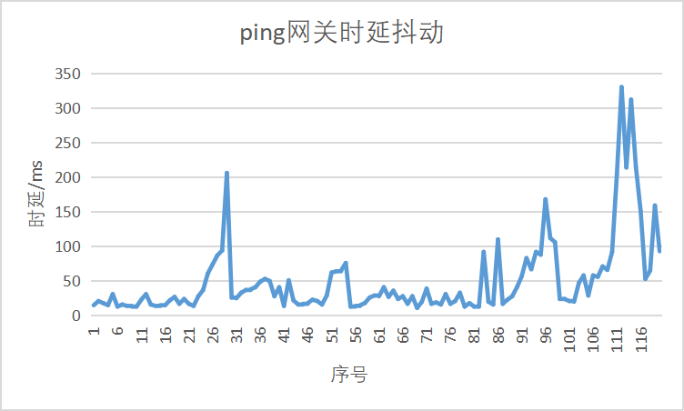
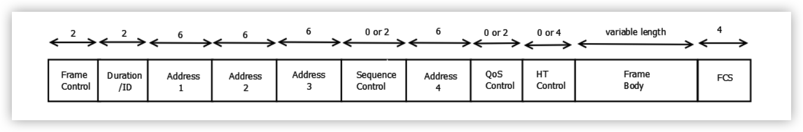
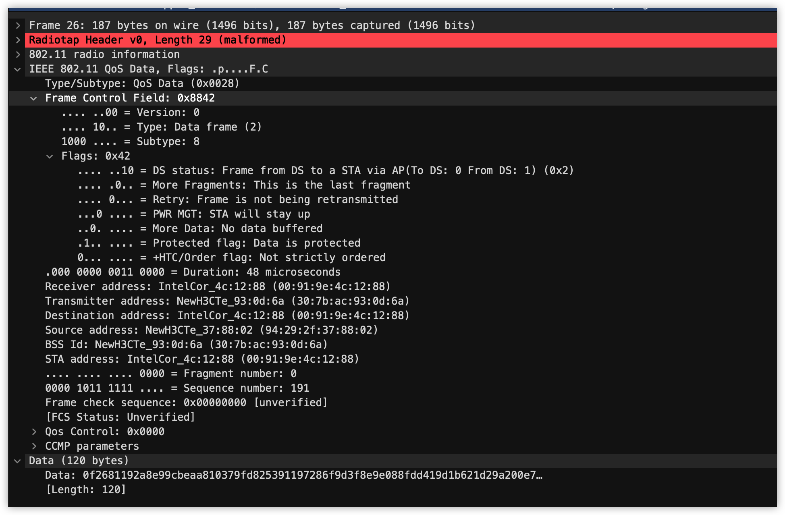

# 无线移动网络技术课程报告

 <b>赵晨阳</b> 杜子煜 章管淮 苗恒硕 钏茗喜 
   

<b>摘要: </b>
 

本小组负责在文图 F3 层(长 118 米，宽 64 米)通过 AirMagnet Survey 进行勘察。随后在勘察基础上，进一步选择上网体验优秀与糟糕的两位置的无线网络状况进行监测与分析，对比测试结果。最后，将楼层网络勘察情况与定点网络监测与分析结论汇总为课程报告。
 

<b>关键词: </b>
 

信号覆盖; AP 与 SSID 分析; 定点网络分析; 802.11 协议分析; 

  
 

 目录  
   

[TOC]

## 楼层网络勘查

如图所示，本小组勘察的范围是人文社科图书馆 3 层，总体长 118m，宽 64m，由矩形部分和圆环部分组成。两部分均有图书架和座位，矩形部分另有研讨间和厕所。除此之外，测量范围还包括了楼梯间。

文图 3 层示意图
 

### 信号覆盖

#### 整体信号覆盖情况

    整体信号强度分布
  

根据文图的室内结构，本小组的测量路线分为两部分，先后分别测量了圆环和矩形部分的信号覆盖情况，两段路线及整体信号测量结果如上图所示。图中蓝色的区域信号覆盖情况相对较好，而由绿至黄渐变的区域相对较差（主要分布在地图左上角的厕所附近）。由图可见，文图3层整体信号覆盖情况较好，只在部分区域存在信号覆盖差的情况。

根据上图可以得到以下分析结果：

- 整体来看，矩形部分信号覆盖情况好于圆环部分；

- 距离 AP 较近的区域信号比较远的区域好；
- 厕所、楼梯间等边缘部分信号较差；
- 信号覆盖情况与附近人数关联并不显著，如矩形区域座位密集处信号覆盖好于走廊部分，在此到 AP 的距离是主要影响因素。

#### 单 AP 信号覆盖情况

    11 -28 信号强度分布
  

    39 -23 信号强度分布
  

勘察分析过程中发现文图内部大多数 AP 对应的 SSID 均为 Tsinghua-Secure 或 Tsinghua-IPv4、DIVI 等校园无线网络，少数是手机热点等其他网络。

上图是选择 SSID 为 Tsinghua-Secure 的两个具有代表性 AP 对应的信号强度分布情况。根据信号强度中心位置，可以判断两个 AP 的位置大概分别在圆环部分西侧和矩形部分西侧。其余 AP 的位置确定方法同理。

#### 单 SSID 信号覆盖情况

    Tsinghua-Secure信号强度分布
  

    Tsinghua-IPv4 信号强度分布
  

上图是 Tsinghua-Secure 和 Tsinghua-IPv4 单独两个 SSID 的信号强度分布情况，由图可见二者均与整体信号强度分布相近，而在局部略有区别，比如部分区域 Tsinghua-IPv4 的信号略强于 Tsinghua-Secure。其他 SSID 中校园网络信号强度分布同样与二者相似，而手机热点等网络信号过于繁杂且不具有代表性，没有单独列出讨论。

#### 单信道信号覆盖情况

    信道 1 信号强度分布
  

    信道 6 信号强度分布
  

    信道 11 信号强度分布
  

以上分别选择了 2.4GHz 的 1、6、11 三个信道分析信号强度分布，可见信道 1 在矩形区域西侧、东南侧和圆环区域南侧信号强度较高，信道 6 在矩形区域东北侧和圆环区域东侧强度较高，信道 11 在矩形区域偏东部分的南北两侧和圆环部分的西侧强度较高，这应该是不同 AP 采取信道有所不同的结果。

### AP 位置预测

    AP位置预测
  

根据信号覆盖图，推断出 AP 的位置分布如上图中红色标记处。由于测量时存在一定位置误差，信号强度分布稍微有点偏移，但是大体位置与 AP 真实分布相同。

相较于 AP 真实分布，我们认为 survey 的工作原理应该是先收集周围的无线网络信号的信息，包括信道、信号强度、频带宽度和其他相关数据。然后 Survey 可以分析这些数据并给出有关 WLAN 的性能、覆盖范围和可靠性的报告。

### 干扰强度分布

  =

  

    整体干扰分布
  

  

	单 SSID 干扰分布(Tsinghua-Secure)

  

	单 SSID 干扰分布(Tsinghua-IPv4)

  

	单信道干扰强度分布(channel 1)

  

	单信道干扰强度分布(channel 6)

  

	单信道干扰强度分布(channel 11)

  

  

	单 AP 干扰强度分布(11 -28)

  
  

	单 AP 干扰强度分布(39 -23)

我们发现，由于楼内大量 AP 覆盖的原因，1、6、11 信道干扰强度明显。仅西北角的厕所信号强度弱，干扰也相对较弱。由此我们推测大量的 AP 覆盖会造成干扰。

简而言之西北角受干扰较弱的原因有两点，一是这个区域距离最近的 AP 有一定距离，二是这个区域无线设备少。

### 分析及建议

比较圆环和矩形两个区域，不难发现，由于圆环区域 AP 数量较少，无线信号强度相对要弱于矩形区域，尤其是在圆环区域正北边与矩形相切的地方并没有安放 AP，导致圆环十一点钟方向到一点钟方向这个扇形区域的信号强度不太乐观。考虑到西北角厕所的信号强度不好的情况，我们提出如下建议：

1. 在圆环十二点钟方向切点附近安放 AP；

2. 调整圆环北边矩形中两个 AP 的分布：

- 将左边的 AP 向西移动两米使得西北角厕所无线信号能得到改善；
- 交给右边的一个 AP 向东移动一定距离，使得两个矩形区域中间过渡的通道无线信号得到改善；
- 按上述步骤调整该矩形区域 AP 分布也能避免在添加圆环北边的AP的后加剧该区域的信号干扰。

## 定点网络分析与监测

### 监测点选择

监测点示意图

选取四个监测点，分别为电话亭旁边、厕所附近、第二个厕所附近、圆环12点钟方向。

### 吞吐量测试

使用 iperf 分别测试笔记本和服务器之间的上行、下行 UDP 饱和吞吐量及时延抖动，以及上行、下行 TCP 饱和吞吐量。

#### 电话亭旁边

上行 UDP，时延抖动结果如下：

平均时延 28ms，饱和吞吐量 4Mbps。

下行 UDP，时延抖动结果如下：

平均时延 20ms，饱和吞吐量 4.6Mbps，上下行 TCP 饱和吞吐量为 21Mbps。

#### 厕所旁边

上行 UDP，时延抖动结果如下：

平均时延 56ms，饱和吞吐量 5.8Mbps。

下行 UDP，时延抖动结果如下：

平均时延 15ms，饱和吞吐量 6.6Mbps，上下行 TCP 饱和吞吐量为 31Mbps。

#### 第二个厕所旁边

上行 UDP，时延抖动结果如下：

平均时延 13ms，饱和吞吐量 4.9Mbps

下行 UDP，时延抖动结果如下：

平均时延 21ms，饱和吞吐量 5.1Mbps，上下行 TCP 饱和吞吐量为 27Mbps。

#### 圆盘 12 点钟方向

上行 UDP，时延抖动结果：

平均时延 15ms，饱和吞吐量 7.9Mbps。

下行 UDP，时延抖动结果：

平均时延 14ms，饱和吞吐量 7.8Mbps，上下行 TCP 饱和吞吐量为 35Mbps

#### 问题分析

对比各监测点的吞吐量及时延数据，发现监测点 2、4 的吞吐量高于监测点 1、3，而各监测点的平均时延和时延抖动程度都较低。

从吞吐量的比较看出，监测点 2、4 的数据传输效率高于监测点 1、3。

### 时延测试

对服务器以及网关分别发出 ping 请求，分别绘制时延抖动曲线。

#### 电话亭旁边

ping 服务器结果

平均时延 38ms，最长 228ms，最短 8ms，标准差 36ms，丢包率 0%。

ping 网关结果

平均时延 57ms，最长 261ms，最短 13ms，标准差 43ms，丢包率 0%。

#### 厕所附近

ping 服务器结果

平均时延 112ms，最长 541ms，最短 14ms，标准差 115ms，丢包率 0%。

ping 网关结果

平均时延 55ms，最长 261ms，最短 11ms，标准差 42ms，丢包率 0%。

#### 第二个厕所附近

ping 服务器结果

平均时延 29ms，最长 168ms，最短 8ms，标准差 23ms，丢包率 0%。

ping 网关结果

平均时延 29ms，最长 320ms，最短 5ms，标准差 36ms，丢包率 0%。

#### 圆环12 点钟方向

ping 服务器结果

平均时延 110ms，最长 1735ms，最短 10ms，标准差 197ms，丢包率 3.3%。

ping 网关结果

平均时延 50ms，最长 330ms，最短 11ms，标准差 56ms，丢包率 0%。

#### 问题分析

根据时延抖动情况来看，监测点 1、3 的平均时延以及时延抖动程度最小，这两个地点分别 ping 服务器与网关的效果相近；而监测点 2、4 的平均时延以及时延抖动程度都偏大，ping 服务器的平均时延与标准差均高于 ping 网关的对应统计量。

从时延的比较看出，监测点 1、3 的无线网络质量优于监测点 2、4。

## Analyzer 无线网络状况分析

实验中，小组选取了四个位置，利用 Analyzer 对无线网络状况进行了探测和记录，分别是三楼电话亭处、东北角厕所位置、西北角厕所位置和圆环十二点钟方向。

### 电话亭处

#### 监听到 AP 的 SSID、MAC 地址、协议类型和信道

| SSID            | MAC               | Protocol | Channel |
| --------------- | ----------------- | -------- | ------- |
| Tsinghua-Secure | 30:7B:AC:93:30:39 | 802.11n  | 11      |
| Tsinghua-Secure | 30:7B:AC:05:6F:59 | 802.11n  | 1       |
| Tsinghua-Secure | 30:7B:AC:93:0B:79 | 802.11n  | 6       |
| Tsinghua-Secure | 30:7B:AC:08:34:6A | 802.11ac | 36      |
| Tsinghua-IPv4   | 30:7B:AC:93:20:B7 | 802.11n  | 1       |
| Tsinghua-Secure | 30:7B:AC:05:6F:4A | 802.11ac | 40      |
| Tsinghua-Secure | 30:7B:AC:93:1F:4A | 802.11ac | 165     |
| Tsinghua-IPv4   | 30:7B:AC:05:6F:48 | 802.11ac | 40      |
| Tsinghua-IPv4   | 30:7B:AC:05:6F:57 | 802.11n  | 1       |
| Tsinghua-Secure | 30:7B:AC:93:30:2A | 802.11ac | 157     |

Top 10 AP Address

根据 AP 的实际物理位置，与 AP 关联的 Client 分布如图所示：

AP 与 Client 分布

#### 信道信号强度和信噪比情况

| Channel | Utilization | Throughput | MAX_Signal_Strength | AP   |
| ------- | ----------- | ---------- | ------------------- | ---- |
| 1       | 1.30%       | 188.9Kbps  | -60dBm              | 40   |
| 6       | 2.85%       | 731.0Kbps  | -67dBm              | 64   |
| 11      | 4.70%       | 3.7Mbps    | -54dBm              | 43   |

各 AP 不同 channel 的信号强度如图：

Channel 1 Signal Strength

Channel 6 Signal Strength

Channel11 Signal Strength

信号强度对比

信噪比为 52dB

#### 分析评价

可以看出在所有的 SSID 中 Tsinghua-Secure 占比最高。2.4G 频段的各信道的信号强度在 -60dBm 上下，信号强度良好。信噪比为 52dB，信噪比较高。总体来看该点的信号强度良好，干扰不强，体验良好。

#### 针对使用量第一的 AP: 30:7B:AC:93:30:39 分析

| Broadcast | Multicast | Unicast | Total |
| --------- | --------- | ------- | ----- |
| 3.33%     | 0.34%     | 96.34%  | 90.5M |

| Retry | Frag | Total |
| ----- | ---- | ----- |
| 13.1K | 0    | 90.4M |

可以计算出重传率为：0.0145%

针对该 AP 使用 WireShark 抓包，共抓到 426 个包，时间跨度为 19.326s，其中

| Beacon Frame | Data Frame | QoS Data Frame |
| ------------ | ---------- | -------------- |
| 4            | 421        | 1              |

#### 单 AP 分析

可以看到该 AP 的 Address 以 Unicast 为主，Frame 以 Data 为主，正在以正常状态传输数据。

### 东北角厕所处

#### 监听到 AP 的 SSID、MAC 地址、协议类型和信道

| SSID            | MAC               | Protocol | Channel |
| --------------- | ----------------- | -------- | ------- |
| Tsinghua-Secure | 30:7B:AC:09:73:2A | 802.11ac | 153     |
| Tsinghua-Secure | 90:E7:10:2B:FD:6A | 802.11ac | 149     |
| Tsinghua-Secure | 30:7B:AC:09:73:39 | 802.11n  | 1       |
| Tsinghua-IPv4   | 30:7B:AC:09:75:77 | 802.11n  | 11      |
| Tsinghua-Secure | 30:7B:AC:09:75:6A | 802.11ac | 48      |
| Tsinghua-Secure | 30:7B:AC:05:7A:8A | 802.11ac | 44      |
| KFF-5G          | 68:77:24:38:61:96 | 802.11n  | 11      |
| Tsinghua-Secure | 30:7B:AC:05:6A:99 | 802.11n  | 11      |
| Tsinghua-Secure | 90:E7:10:2B:FD:79 | 802.11n  | 6       |
| eduroam         | 30:7B:AC:05:7A:90 | 802.11n  | 11      |

Top 10 AP Address

根据 AP 的实际物理位置，与 AP 关联的 Client 分布如图所示：

AP 与 Client 分布

#### 信道信号强度和信噪比情况

| Channel | Utilization | Throughput | MAX_Signal_Strength | AP   |
| ------- | ----------- | ---------- | ------------------- | ---- |
| 1       | 7.46%       | 360.7Kbps  | -80dBm              | 22   |
| 6       | 1.33%       | 155.1Kbps  | -52dBm              | 13   |
| 11      | 4.55%       | 173.5Kbps  | -72dBm              | 19   |

各 AP 不同 channel 的信号强度如图：

Channel 1 Signal Strength

Channel 6 Signal Strength

Channel 11 Signal Strength

信号强度对比

信噪比为 26dB

#### 分析评价

可以看出在所有的 SSID 中 Tsinghua-Secure 占比最高。2.4G 频段的各信道的信号强度在 -80dBm 上下，信号强度较差。信噪比为 26dB，噪声功率较高。总体来看该点的信号强度较差，体验较差。

#### 针对使用量第一的 AP: 30:7B:AC:09:73:2A 分析

| Broadcast | Multicast | Unicast | Total |
| --------- | --------- | ------- | ----- |
| 4.62%     | 0.24%     | 95.14%  | 7.6M  |

| Retry | Frag | Total |
| ----- | ---- | ----- |
| 372   | 0    | 7.3M  |

可以计算出重传率为：0.0051%。

针对该 AP 使用 WireShark 抓包，共抓到 5452 个包，时间跨度为 20.137s，其中：

| Beacon Frame | Data Frame | QoS Data Frame | Block ack |
| ------------ | ---------- | -------------- | --------- |
| 4            | 421        | 4593           | 54        |

#### 单 AP 分析

可以看到该 AP 的 Address 以 Unicast 为主，Frame 以 Data 为主，正在以正常状态传输数据。值得注意的是，实验中我们抓取到大量的 QoS 数据帧，说明抓包时大多数使用该 AP 的终端都支持 QoS 传输，QoS 数据中会多一个 QoS 控制域，包含服务优先级等信息，从而提供更有预测性的网络服务。

### 西北角厕所处

#### 监听到 AP 的 SSID、MAC 地址、协议类型和信道

| SSID            | MAC               | Protocol | Channel |
| --------------- | ----------------- | -------- | ------- |
| Tsinghua-Secure | 30:7B:AC:05:6F:4A | 802.11ac | 40      |
| Tsinghua-Secure | 30:7B:AC:93:30:39 | 802.11n  | 11      |
| Tsinghua-IPv4   | 30:7B:AC:05:6F:48 | 802.11ac | 40      |
| Tsinghua-Secure | 30:7B:AC:03:0B:79 | 802.11n  | 6       |
| Tsinghua-IPv4   | 30:7B:AC:05:6F:57 | 802.11n  | 1       |
| Tsinghua-Secure | 30:7B:AC:08:34:6A | 802.11ac | 36      |
| Tsinghua-Secure | 30:7B:AC:09:79:79 | 802.11n  | 11      |
| Tsinghua-Secure | 30:7B:AC:93:1F:4A | 802.11ac | 165     |
| Tsinghua-Secure | 30:7B:AC:05:6F:59 | 802.11n  | 1       |
| Tsinghua-Secure | 30:7B:AC:92:E6:4A | 802.11ac | 161     |

Top 10 AP Address

根据 AP 的实际物理位置，与 AP 关联的 Client 分布如图所示：

AP 与 Client 分布

#### 信道信号强度和信噪比情况

| Channel | Utilization | Throughput | MAX_Signal_Strength | AP   |
| ------- | ----------- | ---------- | ------------------- | ---- |
| 1       | 4.20%       | 100.1Kbps  | -63dBm              | 30   |
| 6       | 4.36%       | 243.3Kbps  | -76dBm              | 73   |
| 11      | 6.46%       | 674.9Kbps  | -74dBm              | 53   |

各 AP 不同 channel 的信号强度如图：

Channel 1 Signal Strength

Channel 6 Signal Strength

Channel 11 Signal Strength

信号强度对比

信噪比为 -74dB

#### 分析评价

可以看出在所有的 SSID 中 Tsinghua-Secure 占比最高。2.4G 频段的各信道的信号强度在 70dBm 上下，信号强度一般。信噪比为 46dB，噪声功率较大。总体来看该点的信号强度有待改善，干扰也较强。

#### 针对使用量第一的 AP: 30:7B:AC:05:6F:4A 分析

| Broadcast | Multicast | Unicast | Total |
| --------- | --------- | ------- | ----- |
| 13.18%    | 0.62%     | 86.20%  | 33.0M |

| Retry | Frag | Total |
| ----- | ---- | ----- |
| 6.2K  | 0    | 31.8M |

可以计算出重传率为：0.01950%。

针对该 AP 使用 WireShark 抓包，共抓到 7566 个包，时间跨度为 8.191s，其中：

| Beacon Frame | Data Frame | QoS Data Frame | Block ack | Association Response |
| ------------ | ---------- | -------------- | --------- | -------------------- |
| 1            | 7353       | 176            | 35        | 1                    |

#### 单 AP 分析

可以看到该 AP 的 Address 中 Unicast 的比例显著低于其他点，Frame 以 Data 帧的比例也较低，但该 AP 工作状态也正常。

### 圆环十二点钟方向处

#### 监听到 AP 的 SSID、MAC 地址、协议类型和信道

| SSID            | MAC               | Protocol | Channel |
| --------------- | ----------------- | -------- | ------- |
| Tsinghua-IPv4   | 30:7B:AC:93:38:B7 | 802.11n  | 1       |
| Tsinghua-Secure | 30:7B:AC:05:6F:4A | 802.11ac | 40      |
| Tsinghua-Secure | 30:7B:AC:93:0B:79 | 802.11n  | 6       |
| Tsinghua-Secure | 30:7B:AC:93:16:CA | 802.11ac | 40      |
| Tsinghua-Secure | 30:7B:AC:93:30:39 | 802.11n  | 11      |
| Tsinghua-IPv4   | 30:7B:AC:09:73:48 | 802.11ac | 40      |
| Tsinghua-IPv4   | 30:7B:AC:05:6F:48 | 802.11ac | 40      |
| Tsinghua-Secure | 30:7B:AC:93:1F:4A | 802.11ac | 165     |
| Tsinghua-Secure | 30:7B:AC:93:00:EA | 802.11ac | 60      |
| Tsinghua-Secure | 30:7B:AC:40:A5:AA | 802.11ac | 161     |

Top 10 AP Address

根据 AP 的实际物理位置，与 AP 关联的 Client 分布如图所示：

AP 与 Client 分布

#### 信道信号强度和信噪比情况

| Channel | Utilization | Throughput | MAX_Signal_Strength | AP   |
| ------- | ----------- | ---------- | ------------------- | ---- |
| 1       | 3.58%       | 2.9Mbps    | -56dBm              | 38   |
| 6       | 12.51%      | 3.0Mbps    | -50dBm              | 64   |
| 11      | 1.47%       | 172.5Kbps  | -56dBm              | 65   |

各 AP 不同 channel 的信号强度如图：

Channel 1 Signal Strength

Channel 6 Signal Strength

Channel 11 Signal Strength

信号强度对比

信噪比为 41dB

#### 分析评价

可以看出在所有的 SSID 中 Tsinghua-Secure 占比最高。2.4G 频段的各信道的信号强度在 50dBm～60dBm，信号强度良好。信噪比为 41dB，噪声功率较大。总体来看该点的信号强度较好，但干扰也较强。

#### 针对使用量第一的 AP: 30:7B:AC:93:38:B7 分析

| Broadcast | Multicast | Unicast | Total |
| --------- | --------- | ------- | ----- |
| 0.23%     | 0.00%     | 99.77%  | 53.2M |

| Retry | Frag | Total |
| ----- | ---- | ----- |
| 7.3K  | 0    | 53.2M |

可以计算出重传率为：0.01372%。

针对该 AP 使用 WireShark 抓包，共抓到 10073 个包，时间跨度为 8.726s，其中：

| Beacon Frame | ARP Data Frame | Block ack |
| ------------ | -------------- | --------- |
| 1            | 7              | 1         |

#### 单 AP 分析

可以看到该 AP 的 Address 以 Unicast 为主，Frame 以 Data 为主，正在以正常状态传输数据。

## 字段解析

用 Analyzer 在 ping 的过程中进行抓包，保存为 .ecp 文件并用 Wireshark 打开如下：

Wireshark 解析示意图

可以从图中看到，有数量较多的 Beacon 帧（管理帧）、Data 帧（数据帧），此外还有 Acknowledgement 帧（控制帧）。

一般而言，一个典型的 802.11 帧的结构一般如下图所示：

802.11 帧典型结构

帧中拥有一个统一的控制字段（Frame Control），如下图所示：

Frame Control 示意图

其中各个位的作用如下：

- Protocol Version：总是 0；
- Type / Subtype：Type 定义了该帧是何种类型的帧（数据、控制、管理、扩展），SubType 则进一步定义了帧种类；
- ToDS / FromDS：指示帧的目的地是否为传输系统；
- More Fragments：指示之后是否还有分段；
- Retry：指示是否是重传帧；
- Power Mgmt：指定传送端在完成目前的基本帧交换之后是否进人省电模式；
- More Data：为服务处于省电模式的工作站, 基站会将这些由 “传输系统” 接收而来的帧加以暂 存。基站如果设定此位, 代表至少有一个帧待传送给休眠的工作站；
- Protected Frame：指示帧是否受到链路层安全协议的保护。

### Beacon 帧

Beacon 帧为 802.11 协议中规定的管理帧之一，选取其中的一个 Beacon 帧，其字段在 Wireshark 中解析如下图所示：

Beacon 帧具体情况

下面选取其中部分字段进行解释：

- Timestamp：该 AP 开机以来已经工作的时间，以微秒为单位；

- Beacon Interval: 发送广播帧的间隔, 这里是 $0.1024 \mathrm{~s}$, 意味着该 AP 每秒会进行约 10 次广播；

- Capability Info：用来标识自己是否具有某种功能，这里的 0x8001 中有两位为 1，我们具体展开如下：

  

  
Capability Info 具体情况

  每个 bit 各自代表一个旗标，对应到网络所具备的某种特殊功能。工作站会使用这些公告数据来判断自己是否支持该 BSS 所有的功能。没有实现性能公告中所有功能的工作站，就无法加入该 BSS。参考上图，表示是 AP，然而没有实现 EPD，QoS 等等。

- SSID：一个至多 32 byte 的字段, 这里就是 AP 的名字 DIVI-2。如果该字段为 0，则为一个 probe request 帧，通过该帧做主动扫描；

- Supported Rates：声明所支持的速率；

- Country Info：国家代号, 不同的国家有不同的规定，也限制了最大发射功率；

- HT Capability Info /  HT Operation info：高吞吐量功能信息与高吞吐量操作信息。802.11n 的 mac 层给 802.11 的 mac 层加入了高吞吐量单元。所有新加的 802.11n 功能都是通过管理帧中的 HT 单元才得以实现；

- Extended Capabilities：扩展功能，此 AP 并未实现；

- VHT Capabilities / VHT Operation：甚高吞吐量功能与操作。二者是 802.11ac 中加入的字段，用于管理 ac 的功能；

- Vendor Specific：特定供应商，厂商自定的 OUI。

### Data 帧

Data 帧具体情况

802.11 协议中规定了多种数据帧，图中的数据帧 SubType 为 0，是最简单的一种数据帧，此外，在抓包结果中还找到了 QoS 数据帧：

QoS 帧具体情况

同样，我们选取其中部分字段进行解释：

- Receiver Address：接收方 Mac 地址，这里是 AP；
- Transmitter Address：发送方 Mac 地址，这里是用户设备；
- QoS Control：QoS 的控制字段，某三位指示了服务优先级，越低越高，这里是 0，为最高优先级（Best Effort）；

### Request-to-send 帧

RTS 帧为 802.11 协议的控制帧之一。当 AP 向某个客户端发送数据的时候，AP 会向客户端发送一个 RTS 报文，这样在 AP 覆盖范围内的所有设备在收到 RTS 后都会在指定的时间内不发生数据。其字段在 Wireshark 中解析如下：

RTS 帧具体情况

其中，Transmitter Address 和 Receiver Address 分别表示了 RTS 帧收发方的 Mac 地址。

### 统计分析

在文图 3 楼信号较差的电话亭处，对 1、6、11 三个信道进行抓包，总数为 32448。统计分析结果如下：

| wlan.fc.type_subtype  | wlan.fc.ds == 1(数量) | wlan.fc.ds == 1(比例) | wlan.fc.ds == 2(数量) | wlan.fc.ds == 2(比例) |
| --------------------- | --------------------- | --------------------- | --------------------- | --------------------- |
| 8 (Beacon frame)      | 159                   | 0.49%                 | 197                   | 0.61%                 |
| 25 (802.11 Block Ack) | 31                    | 0.10%                 | 33                    | 0.10%                 |
| 27 (Request-to-send)  | 42                    | 0.13%                 | 45                    | 0.14%                 |
| 28 (Clear-to-send)    | 36                    | 0.11%                 | 44                    | 0.14%                 |
| 29 (Acknowledgement)  | 28                    | 0.09%                 | 46                    | 0.14%                 |
| 32 (Data)             | 70                    | 0.22%                 | 7411                  | 22.84%                |
| 40 (QoS Data)         | 1204                  | 3.71%                 | 1373                  | 4.23%                 |

    不同方向不同种类帧的数量和比例

上表是不同方向(wlan.fc.ds == 1 或 2)不同种类帧的数量和比例，由于涉及到类型较多，只选取了占比较高且具有代表性的几种类型，可见出现最多的类型是 Beacon frame，Data，QoS Data 三类。

| BSS Id            | Source  address   | Type/Subtype            | 数量 | 比例  |
| ----------------- | ----------------- | ----------------------- | ---- | ----- |
| 90:e7:10:2b:fd:79 | 7e:92:8e:f1:6f:5c | Null function (No data) | 556  | 1.71% |
| 30:7b:ac:93:0b:79 | ac:2b:6e:6b:b6:e7 | QoS Data                | 188  | 0.58% |
| 30:7b:ac:93:30:37 | a4:93:3f:65:b1:d5 | QoS Data                | 57   | 0.18% |
| 72:f8:d0:33:32:94 | bc:d0:74:02:92:6d | Null function (No data) | 55   | 0.17% |
| 30:7b:ac:05:6f:59 | 38:68:93:ff:92:1d | QoS Data                | 49   | 0.15% |
| 30:7b:ac:09:73:39 | 50:5b:c2:e3:c7:e5 | QoS Data                | 47   | 0.14% |
| 30:7b:ac:93:30:39 | 7c:b0:c2:ba:44:8d | QoS Data                | 45   | 0.14% |
| 02:a5:56:03:a3:75 | 2c:c5:b3:83:e2:b0 | Beacon frame            | 39   | 0.12% |
| 30:fb:55:9a:a1:15 | 7a:c4:0c:15:f1:42 | QoS Data                | 39   | 0.12% |
| 30:7b:ac:09:79:79 | 31:1b:67:af:81:e1 | QoS Data                | 38   | 0.12% |

    不同方向重传帧的数量和比例(wlan.fc.ds == 1)

| BSS Id            | Destination address   | Type/Subtype | 数量 | 比例  |
| ----------------- | --------------------- | ------------ | ---- | ----- |
| 30:7b:ac:05:6f:59 | 22:ce:93:91:f0:0f     | QoS Data     | 330  | 1.02% |
| 30:7b:ac:93:20:b7 | f2:bc:0e:$\!$cd:cb:5d | QoS Data     | 119  | 0.37% |
| 30:7b:ac:93:30:37 | a4:93:3f:65:b1:d5     | QoS Data     | 99   | 0.31% |
| 30:7b:ac:09:73:39 | 50:5b:c2:e3:c7:e5     | QoS Data     | 75   | 0.23% |
| 90:e7:10:2b:fd:79 | 7e:92:8e:f1:6f:5c     | QoS Data     | 66   | 0.20% |
| 30:7b:ac:05:6f:59 | 38:68:93:ff:92:1d     | QoS Data     | 57   | 0.18% |
| 30:7b:ac:05:6f:59 | 0a:3d:4d:4a:91:bd     | QoS Data     | 45   | 0.14% |
| 30:7b:ac:08:34:79 | f2:d0:82:81:2f:f2     | QoS Data     | 44   | 0.14% |
| 30:7b:ac:09:79:79 | ff:ff:ff:ff:13:eb     | Data         | 39   | 0.12% |
| 1b:e5:7c:c3:fe:59 | 22:ce:93:91:f0:b3     | QoS Data     | 39   | 0.12% |

    不同方向重传帧的数量和比例(wlan.fc.ds == 2)

以上是不同方向(wlan.fc.ds == 1或2)重传帧的数量和比例，分别按(BSSID，SA，帧类型)和(BSSID，DA，帧类型)统计。由于涉及到的类型较多，仅列出占比最高的前 10 项。可见重传帧中最多的是 QoS Data 类型。

| BSS Id            | Destination address | Type/Subtype                | 数量 | 比例  |
| ----------------- | ------------------- | --------------------------- | ---- | ----- |
| 00:25:00:ff:94:73 | ff:ff:ff:ff:ff:ff   | Action                      | 496  | 1.53% |
| 90:e7:10:2b:fd:79 | 90:e7:10:2b:fd:79   | QoS Null function (No data) | 390  | 1.20% |
| ff:ff:ff:ff:ff:ff | ff:ff:ff:ff:ff:ff   | Probe Request               | 150  | 0.46% |
| 72:f8:d0:33:32:94 | ff:ff:ff:ff:ff:ff   | Beacon frame                | 99   | 0.31% |
| 30:7b:ac:08:34:79 | ff:ff:ff:ff:ff:ff   | Beacon frame                | 85   | 0.26% |
| 30:7b:ac:08:34:73 | ff:ff:ff:ff:ff:ff   | Beacon frame                | 78   | 0.24% |
| 30:7b:ac:09:73:37 | ff:ff:ff:ff:ff:ff   | Beacon frame                | 69   | 0.21% |
| 30:7b:ac:09:73:34 | ff:ff:ff:ff:ff:ff   | Beacon frame                | 64   | 0.20% |
| 30:7b:ac:09:73:31 | ff:ff:ff:ff:ff:ff   | Beacon frame                | 57   | 0.18% |
| 30:7b:ac:09:73:33 | ff:ff:ff:ff:ff:ff   | Beacon frame                | 53   | 0.16% |

wlan.fc.ds == 0 按照(BSSID，DA，帧类型)统计

| BSS Id            | Source address    | Type/Subtype                | 数量 | 比例  |
| ----------------- | ----------------- | --------------------------- | ---- | ----- |
| 90:e7:10:2b:fd:79 | 7e:92:8e:f1:6f:5c | QoS Null function (No data) | 395  | 1.22% |
| 72:f8:d0:33:32:94 | 72:f8:d0:33:32:94 | Beacon frame                | 95   | 0.29% |
| 30:7b:ac:08:34:79 | 30:7b:ac:08:34:79 | Beacon frame                | 88   | 0.27% |
| 30:7b:ac:09:73:31 | 30:7b:ac:09:73:31 | Beacon frame                | 79   | 0.24% |
| 30:7b:ac:09:73:32 | 30:7b:ac:09:73:32 | Beacon frame                | 73   | 0.22% |
| 30:7b:ac:09:73:37 | 30:7b:ac:09:73:37 | Beacon frame                | 69   | 0.21% |
| 30:7b:ac:09:73:33 | 30:7b:ac:09:73:33 | Beacon frame                | 62   | 0.19% |
| 30:7b:ac:08:34:73 | 30:7b:ac:08:34:73 | Beacon frame                | 57   | 0.18% |
| 30:7b:ac:09:73:30 | 30:7b:ac:09:73:30 | Beacon frame                | 53   | 0.16% |
| 90:e7:10:2b:fd:71 | 90:e7:10:2b:fd:71 | Beacon frame                | 51   | 0.16% |

wlan.fc.ds == 0 按照(BSSID，SA，帧类型)统计

以上是 wlan.fc.ds == 0 的帧分别按照(BSSID，DA，帧类型)和(BSSID，SA，帧类型)的统计结果。由于涉及到的类型较多，仅列出占比最高的前 10 项。可见出现频率较高的是广播的 Beacon frame 型，说明此处 AP 发送 Beacon frame 间隔低，设备易于连接到可用 AP。

根据以上统计数据，可以猜测大量 QoS Data 帧的重传现象是导致网络质量不佳的主要原因，推测由此处较强的信号干扰导致。